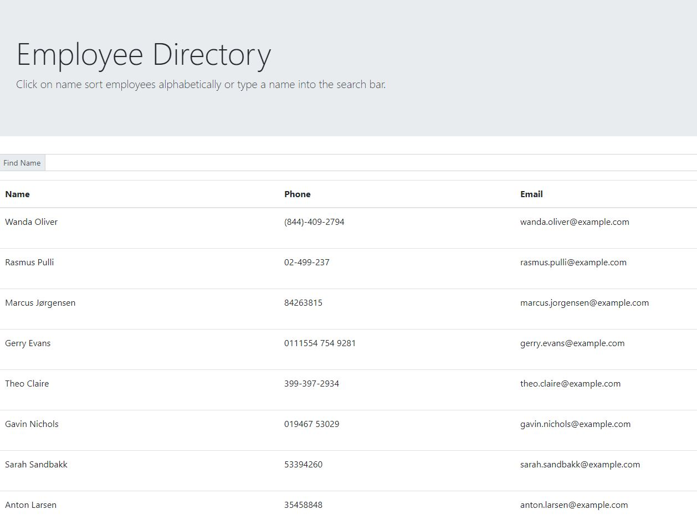

# userdirectory

## Description

A list of employees is generated using a random user generator api. This list is able to be sorted alphabetically or filtered by name with the input bar.

## Table of Contents

- [Installation](#installation)

- [Usage](#usage)

- [Screenshot](#screenshot)

- [License](#license)

- [Links](#links)

- [Questions](#questions)

## Installation

Install necessary dependencies with npm i command.

## Usage

Click on name to sort alphabetically or type a name into the search bar.

## Screenshot

## License

Licensed under MIT license.

## Links

https://wyoung60.github.io/userdirectory  
https://github.com/wyoung60/userdirectory

## Questions

Email wesley.young@du.edu with any questions.
